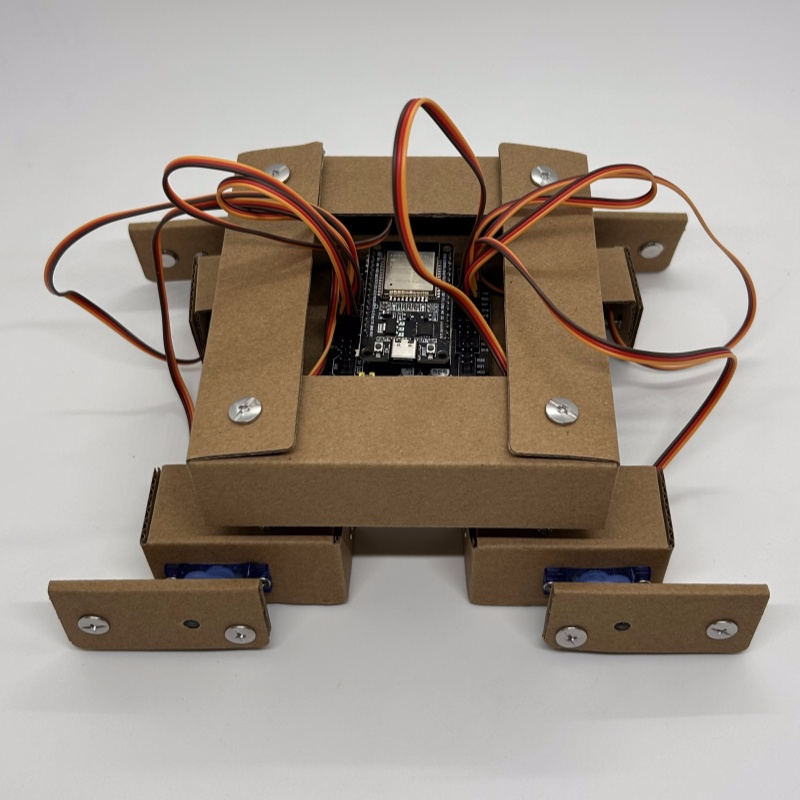

## DIY舵机学习套件3合1

使用 ESP32 做为开发板，micorpython 或 auduino 进行编程，wifi 远程遥控机器人  
特点和亮点：使用折叠纸板做为机器人的外壳，大降低了硬件成本

本项目包含了3个机器人：  
1. dog 小狗，使用2个舵机，是最简单的

2. otto 机器人，使用4个舵机，参考开源项目 [ottodiy](https://www.ottodiy.com/) 修改而成

3. quad 四足机器人，使用8个舵机

淘宝店: [AniPython](https://item.taobao.com/item.htm?abbucket=20&id=791406501041&spm=a230r.7195193.1997079397.6.40b612a29iFV4B)
